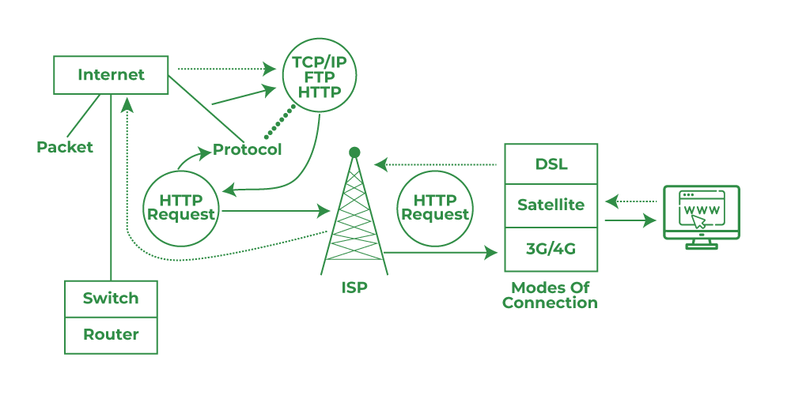

## Cách hoạt động của Internet    
  
##### 1. Khái niệm:  
* Máy khách (Client): điện thoại, máy tính, .....
* Domain: tên miền (ví dụ: facebook.com, youtube.com,......)
* IP: địa chỉ của máy khách, máy chủ, router, .... Giống địa chỉ nhà
* Hệ thống quản lí tên miền (DNS): giống cuốn danh bạ, lưu IP và Doimain tươn ứng
* Máy chủ (Server): Là máy tính cấu hình cao chứa nhiều dữ liệu (ví dụ máy chủ youtube chứa nhiều video)
##### 2. Cách hoạt động:
* Máy khách gõ tên miền
* Hệ thống quản lí tên miền
    * Đổi tên miền sang dạng IP
    * Tìm IP này xem là của máy chủ nào
    * Gửi IP và yêu cầu của máy khách tới máy chủ
* Máy chủ gửi dữ liệu dạng ánh sáng thông qua cáp quang tới
    * Router (Nếu dùng wifi)
        * Router  chuyển tín hiệu ánh sáng sang tín hiệu điện (mã nhị phân) và chuyền lại vào máy khách
        * Máy khách giải mã và hiện giao diện trang web trên máy khách
    * Tháp viễn thông (Nếu dùng gói mạng)
        * Tháp viễn thông chuyển tín hiệu ánh sáng sang sóng điện từ
        * Máy khách giải mã và hiện giao diện trang web trên máy khách
